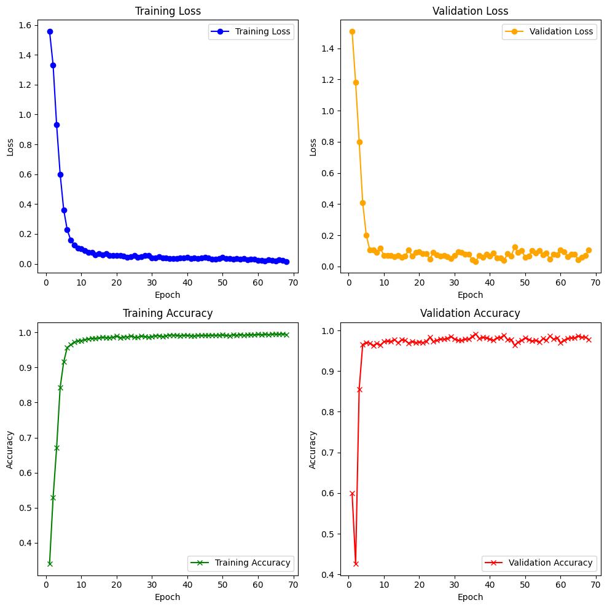
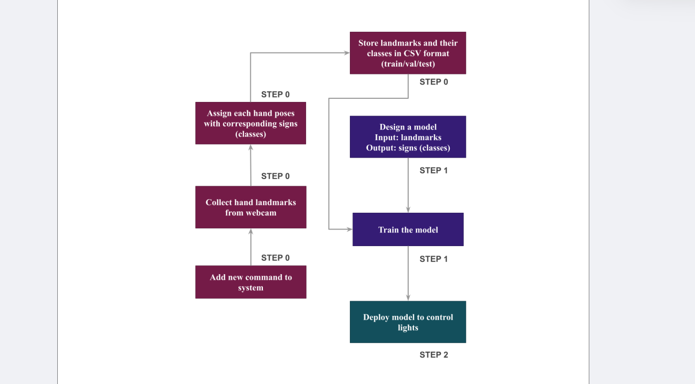

# Controlling Light Project

This project allows for controlling lights through gestures using a trained machine learning model. The project is built using Python, Pytorch, and other libraries to recognize hand gestures and simulate light control based on detected gestures.

## Table of Contents

- [Requirements](#requirements)
- [Installation](#installation)
- [Usage](#usage)
- [Project Structure](#project-structure)
- [License](#license)

## Requirements

Make sure you have the following libraries installed:

- Python 3.10.0
- OpenCV
- PyTorch
- Other dependencies listed in `requirements.txt`

## Results



## Installation

1. Clone the repository to your local machine:

   ```bash
   git clone https://github.com/KietAPCS/Light_Controlling_MLP.git
   cd Controlling_Light
   ```

2. Install the necessary dependencies:

   ```bash
   pip install -r requirements.txt
   ```

## Usage

To run the project, execute the following command in your terminal:

```bash
python detect_simulation.py
```

## Project Structure

The baseline of the project is given below:



## License

This project was done succesfully thanks to the help and guideline from AIO_VIETNAM sources. However, complete code and visualization and other adjustments were totally done by me (KietAPCS).
